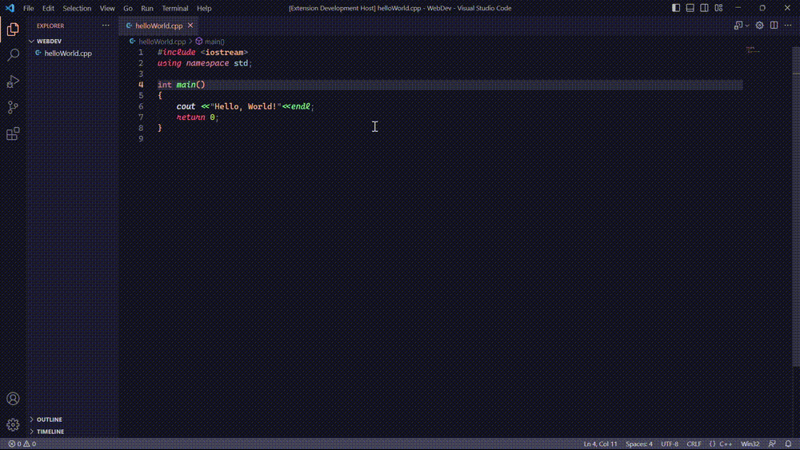

# Run C/C++/C#

## what is this?
This is a `vscode` extension to run `C`, `C++`, `python`,`java` and `C#` files in `vscode` editor

## how to run?
First open a `C`, `C++`, `python`,`java`  file or `C#` project
1. use shortcut `Ctrl+Alt+C` to run the file
1. right click the Text Editor and then click `Compile and run` in editor context menu
1. click `Compile and run` button in editor title menu

----

## Demo

----

## Features

- compile and run `C/C++` file
- compile and run `python` file
- compile and run `java` file
- compile and run `C#` project

----

## Requirements

- `gcc` compiler
- `python` interpreter
- `java` compiler
- `.NET` framework

---

# important note
- `python3` compiler is not supported. It try to compile with `python` compiler

----

report bugs/issues here [github](https://github.com/AbrarShakhi/runccpp-vsce/issues)