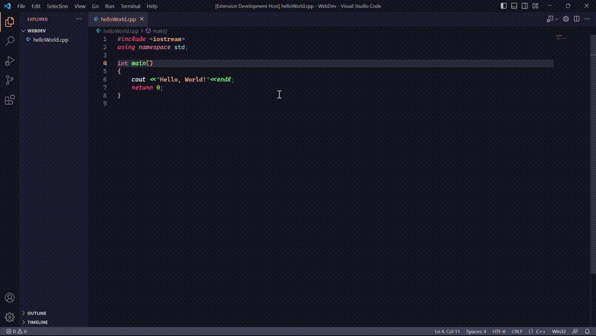

# Run C/C++/C#


## how to run?
First open a `C`, `C++` file or `C#` project
- use shortcut Ctrl+Alt+C
- right click the Text Editor and then click `Compile and run` in editor context menu
- click `Compile and run` button in editor title menu

----

## Demo



----

! this is the code that is executed in the terminal
``` js
if (fileExt === '.c') {
    terminal.show();
    terminal.sendText(`cd "${filePath.substring(0, filePath.lastIndexOf("\\"))}";`);
    terminal.sendText(`gcc "${filePath}" -o "${fileName}"; ./"${fileName}";`);
}
else if (fileExt === '.cpp') {
    terminal.show();
    terminal.sendText(`cd "${filePath.substring(0, filePath.lastIndexOf("\\"))}";`);
    terminal.sendText(`g++ "${filePath}" -o "${fileName}"; ./"${fileName}";`);
}
else if (fileExt === '.cs') {
    terminal.show();
    terminal.sendText(`cd "${filePath.substring(0, filePath.lastIndexOf("\\"))}";`);
    terminal.sendText(`dotnet run;`);
}
```

----

I made this extention to run my own C/C++/C# file. You can install it too.
report bugs/issues here [github](https://github.com/AbrarShakhi/runccpp-vsce/issues)